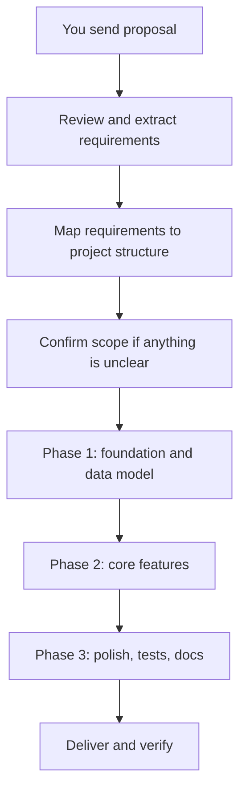

# Mind Mirror Platform — Workflow

This document defines how work proceeds from proposal to delivery.

## Current state

| Item | Status |
|------|--------|
| Project folder | `mind_mirror_platform` (not Formula 67) |
| Entry point | `main.py` |
| Core engine | `mirror.py` — `MindMirror`, `ReflectionEntry` |
| Config | `config.py` — paths, default prompts |
| Data store | `data/entries.json` (created at runtime) |
| Git | Initialized, ready for first commit |
| Dependencies | Stdlib only — `requirements.txt` updated after proposal |

## What to send next

Send your proposal in chat, or paste it into `docs/PROPOSAL.md`. Include whatever you have:

- Goals and target users
- Features (must-have vs nice-to-have)
- UI type (CLI, web, mobile, API, etc.)
- Data / privacy requirements
- Deadline or milestones
- Tech constraints or preferences
- Anything explicitly out of scope

## Workflow after proposal arrives



### Step 1 — Intake

- Read the proposal
- Fill in `docs/PROPOSAL.md` and `docs/SCOPE.md`
- List open questions (if any)

### Step 2 — Scope map

- Break features into phases: **must-have → should-have → nice-to-have**
- Decide what stays in existing files vs new modules
- Update `requirements.txt` only if new packages are needed

### Step 3 — Confirm (only if needed)

- Ask about ambiguous requirements before building
- No confirmation step if the proposal is clear

### Step 4 — Build in phases

| Phase | Focus | Typical outputs |
|-------|--------|-----------------|
| 1 — Foundation | Data model, config, project layout | Updated `mirror.py`, `config.py`, new modules |
| 2 — Core features | Main user-facing behavior from proposal | `main.py` or new app layer |
| 3 — Polish | Tests, README, edge cases, cleanup | `tests/`, updated docs |

### Step 5 — Verify

- Run the app / tests
- Check against `docs/SCOPE.md` checklist
- Hand off with a short summary of what was built

## Project layout (ready to extend)

```
mind_mirror_platform/
├── main.py              # CLI entry point (today)
├── mirror.py            # Core engine
├── config.py            # Settings and prompts
├── data/                # Runtime storage
├── docs/
│   ├── PROPOSAL.md      # Your proposal (paste here)
│   ├── WORKFLOW.md      # This file
│   └── SCOPE.md         # Extracted requirements checklist
├── requirements.txt
└── tests/               # Added when proposal needs tests
```

New modules will be added based on the proposal — for example `api/`, `ui/`, `models/`, or `services/` — without changing this workflow.

## Ready checklist (before implementation)

- [x] Correct project (`mind_mirror_platform`, not `formula`)
- [x] Core journaling engine in place
- [x] `.gitignore` and `requirements.txt`
- [x] `docs/PROPOSAL.md` waiting for your content
- [x] `docs/SCOPE.md` template for requirement tracking
- [ ] Your proposal received
- [ ] Scope confirmed
- [ ] Implementation begins

## How to start after setup

1. Send the proposal in chat **or** edit `docs/PROPOSAL.md`
2. Say something like: *"Here's the proposal — follow the workflow"*
3. Work proceeds automatically through intake → scope → build → verify
